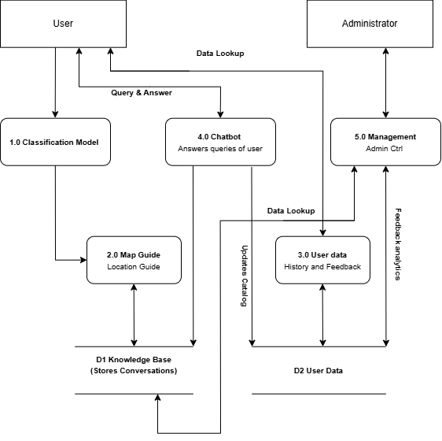
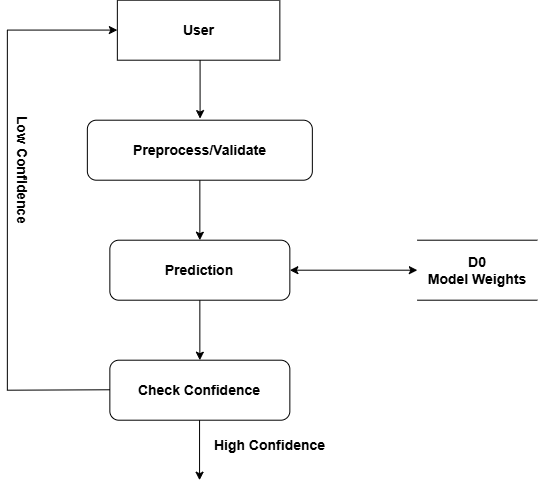
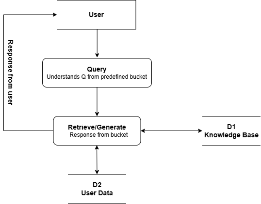
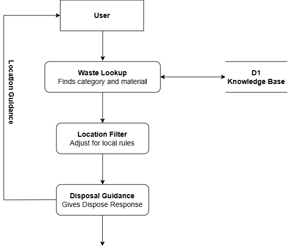
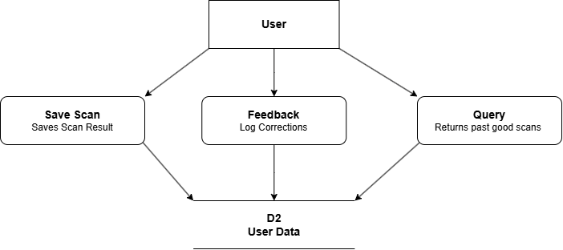
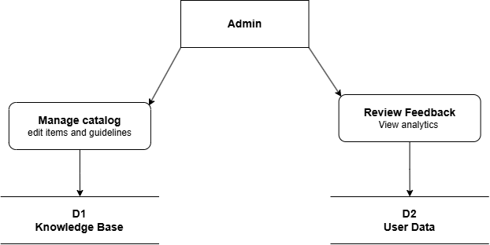
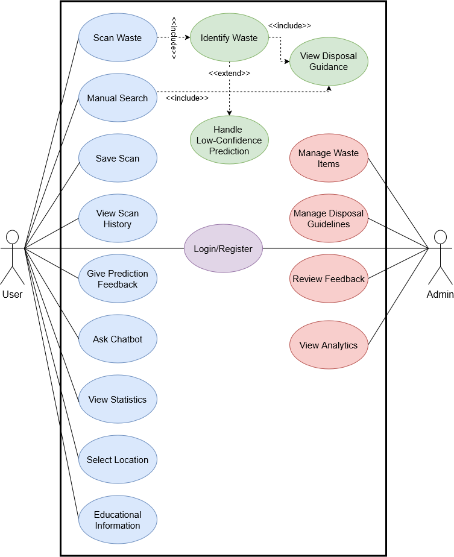

# Sortify

> **AI-Powered Waste Identification & Disposal Guidance**  
> An intelligent mobile system that bridges the gap between raw computer vision predictions and actionable, real-world disposal instructions.

[](https://thapar.edu)
[](https://fastapi.tiangolo.com)
[](https://reactnative.dev)
[](https://pytorch.org)
[](https://www.postgresql.org)
[](LICENSE)

---

## The Problem

Most people want to dispose of everyday waste properly, but practical sorting is confusing:

- **Classification is not guidance**: Knowing an item is a "paper coffee cup" doesn't answer whether the polyethylene lining makes it non-recyclable in your local area.
- **Preparation matters**: Recyclable plastics contaminated with food residue end up in landfills. Items need specific prep steps (rinsing, removing foil seals, separating bottle caps).
- **Hazard & E-waste risks**: Discarding lithium-ion batteries or blister medicine packs into standard bins causes fire and chemical contamination risks.
- **Information is fragmented**: Searching municipal recycling portals mid-disposal creates too much friction for regular habits.

**Sortify** focuses on reducing decision friction right at the bin: snap a photo, get an instant item prediction with confidence metrics, and immediately see clear, step-by-step prep and disposal instructions.

---

## Core Capabilities

| Capability | How It Works | Real-World Benefit |
| :--- | :--- | :--- |
| **Point & Identify** | On-device capture or image upload evaluated through a lightweight PyTorch vision model. | Sub-second classification of everyday packaging, containers, and scrap. |
| **Actionable Guidance** | Prediction maps directly into a curated knowledge base detailing preparation steps and disposal streams. | Users get immediate instructions: *"Rinse container, crush, dispose cap in plastics bin."* |
| **Confidence Fallbacks** | Low-confidence or ambiguous captures prompt the user with ranked alternative suggestions or a manual search fallback. | Prevents model hallucinations from generating incorrect disposal behavior. |
| **Grounded Assistant** | A retrieval-augmented (RAG) conversational bot answering specific questions (*"Can I recycle greasy pizza boxes?"*). | Handles edge cases and ambiguous composite materials naturally. |
| **History & Impact** | Authenticated logging of scanned items, categorical breakdown, and user feedback. | Users can track habits, while user corrections flag model edge cases for retraining. |
| **Admin Catalog Control** | Dedicated administrative interface to curate waste categories, guidelines, and localized rules. | Keeps guidelines accurate without requiring model redeployment. |

---

## Supported Waste Streams

Sortify structures items into 5 actionable disposal streams:

```
┌─────────────────────────────────────────────────────────────────────────┐
│                           SUPPORTED STREAMS                             │
├──────────────┬──────────────┬──────────────┬──────────────┬─────────────┤
│  Recyclable  │   Organic    │   General    │   E-Waste    │  Hazardous  │
│  Plastics,   │ Food scraps, │ Non-recycl-  │   Cables,    │ Batteries,  │
│  paper, tins,│  biodegrad-  │ able films,  │ accessories, │ chemicals,  │
│    glass     │     ables    │ composites   │  batteries   │  medicines  │
└──────────────┴──────────────┴──────────────┴──────────────┴─────────────┘
```

---

## System Architecture

Sortify is engineered as a decoupled, multi-tier system separating user interaction, asynchronous inference, and rules retrieval:

```
  ┌───────────────────────────┐
  │ React Native Mobile App   │  (Camera, Scans, Chatbot UI, History)
  └─────────────┬─────────────┘
                │  HTTPS / REST + JWT Auth
                ▼
  ┌───────────────────────────┐
  │     FastAPI Backend       │  (Validation, Rate Limiting, Business Logic)
  └───┬─────────────┬───────┬─┘
      │             │       │
      ▼             ▼       ▼
┌───────────┐ ┌───────────┐ ┌──────────────────────────────────────┐
│  PyTorch  │ │PostgreSQL/│ │ RAG Assistant Engine                 │
│ Classifier│ │  SQLite   │ │ (Grounded in Verified Knowledge Base)│
│  Inference│ │ Knowledge │ └──────────────────────────────────────┘
└───────────┘ │   Base    │
              └───────────┘
```

### System Context (Level-0 DFD)
High-level boundary showing primary interactions between users, administrators, and external contextual sources:

<p align="center">
  
</p>

### Functional Processes (Level-1 DFD)
Decomposition of system processes including authentication, image ingestion, model scoring, guidelines lookup, and feedback telemetry:

<p align="center">
  
</p>

### Detailed Subsystem Workflows (Level-2 DFDs)

<details>
<summary><b>🔍 1. Machine Learning Inference Pipeline</b> (Click to expand)</summary>
<br>

Covers image validation, normalization, forward pass through the classification model, confidence threshold verification, and fallback routing:

<p align="center">
  
</p>
</details>

<details>
<summary><b>💬 2. Conversational Assistant (RAG Chatbot)</b> (Click to expand)</summary>
<br>

Shows user query parsing, retrieval from the verified waste database, response synthesis, and conversation persistence:

<p align="center">
  
</p>
</details>

<details>
<summary><b>📍 3. Location-Aware Disposal Guidance</b> (Click to expand)</summary>
<br>

Illustrates how regional waste rules and facility mappings supplement raw category instructions:

<p align="center">
  
</p>
</details>

<details>
<summary><b>📊 4. User Scan History & Feedback Loop</b> (Click to expand)</summary>
<br>

Handles scan logging, user habit summaries, and misclassification reporting for model retraining:

<p align="center">
  
</p>
</details>

<details>
<summary><b>⚙️ 5. Administrative Catalog Management</b> (Click to expand)</summary>
<br>

CRUD workflows for managing supported waste classes, safety tips, and monitoring telemetry:

<p align="center">
  
</p>
</details>

---

## Functional Scope (Use Cases)

The application models actors across standard end-users and administrators:

<p align="center">
  
</p>

---

## Tech Stack

| Component | Technology | Rationale |
| :--- | :--- | :--- |
| **Mobile Client** | React Native, TypeScript | Cross-platform camera access, responsive UI, native camera module support. |
| **Backend API** | FastAPI (Python 3.10+) | High-throughput asynchronous endpoints, automatic OpenAPI documentation, native PyTorch interoperability. |
| **ML Inference** | PyTorch, torchvision | Transfer learning with lightweight vision backbones (MobileNetV3 / EfficientNet) for low inference latency. |
| **Storage** | PostgreSQL / SQLite | Relational integrity for user profiles, scan telemetry, and hierarchical waste rule catalogs. |
| **Conversational** | RAG Pipeline + LLM | Natural-language query interface strictly constrained by verified disposal guidelines. |
| **Tooling & CI** | Git, MkDocs Material, Pytest | Automated linting, test coverage, and documentation deployment. |

---

## Repository Structure

```
ucs503p-202627-sortify/
├── README.md                      # Project overview and architecture entry point
├── code/                          # Application source code
│   ├── src/                       # Backend services and logic
│   └── inc/                       # Header / shared modules
├── docs/                          # Project documentation and specifications
│   ├── diagrams/                  # System visuals (DFDs, use case diagrams)
│   │   ├── data_flow_diagram/     # Level-0, Level-1, and Level-2 DFDs
│   │   └── use_case_diagram/      # UML Use Case diagrams
│   └── journals/ -> ../journals   # Symlinked student development journals
├── journals/                      # Weekly engineering logs per team member
├── project-proposal/              # Proposal report (LaTeX source and PDF)
├── project-report-prototype-stage/# Prototype deliverable documentation
├── project-report-final/          # Final engineering evaluation report
├── mkdocs.yml                     # Documentation generator configuration
└── Makefile                       # Build and documentation automation
```

---

<!--
## Getting Started

### 1. Clone the Repository
```bash
git clone https://github.com/Daksh-Aggarwal/ucs503p-202627-sortify.git
cd ucs503p-202627-sortify
```

### 2. Backend Setup
Ensure you have Python 3.10+ installed:

```bash
# Create and activate a virtual environment
python3 -m venv .venv
source .venv/bin/activate

# Install dependencies (once backend dependencies file is configured)
pip install -r requirements.txt
```

### 3. Local Documentation Server
To review the MkDocs documentation locally:

```bash
make docserve
```
The documentation server will launch with live-reload enabled.

-->

## Academic Context

This project is submitted as part of **UCS503P: Software Engineering Project** at **Thapar Institute of Engineering and Technology (TIET)**, Patiala (2026–27 Odd Semester).

- **Course Instructor**: Dr. Jeelani Asif
- **Team Members**:
  - **Daksh Aggarwal** (Roll No: `1024160015`) — [daggarwal_be24@thapar.edu](mailto:daggarwal_be24@thapar.edu)
  - **Mankirat Singh** (Roll No: `1024160002`) — [msingh3_be24@thapar.edu](mailto:msingh3_be24@thapar.edu)
  - **Saket Gatyan** (Roll No: `1024160028`) — [sgatyan_be24@thapar.edu](mailto:sgatyan_be24@thapar.edu)

---

## License

This project is licensed under the [MIT License](LICENSE).
